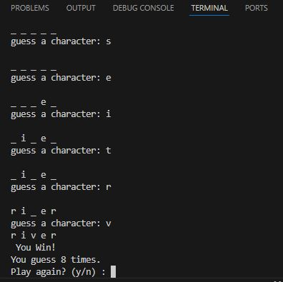

## Overview
A command-line word guessing game written in Python where players attempt
to uncover a hidden word by guessing one letter at a time. The game
provides input validation, tracks previous guesses, and allows replay.

## Features
- Random word selection
- Input validation for guesses
- Tracks previously guessed letters
- Win condition detection
- Replay functionality

## What I Learned
- Managing game state in a loop
- Using sets to prevent duplicate guesses
- Validating user input

## Demo

